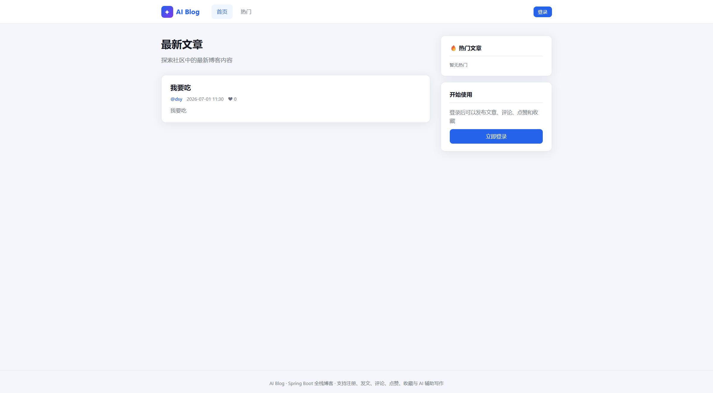
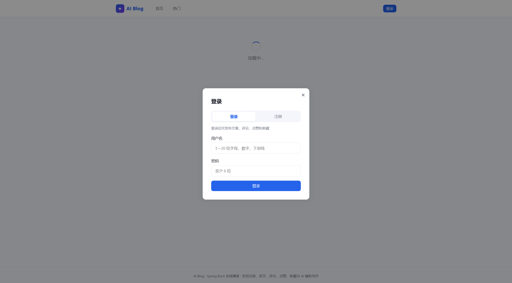
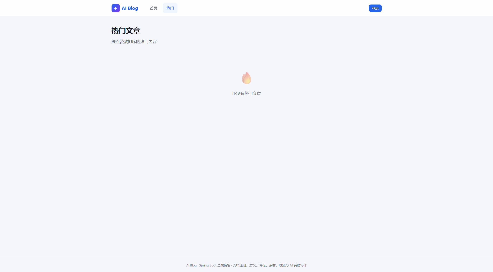
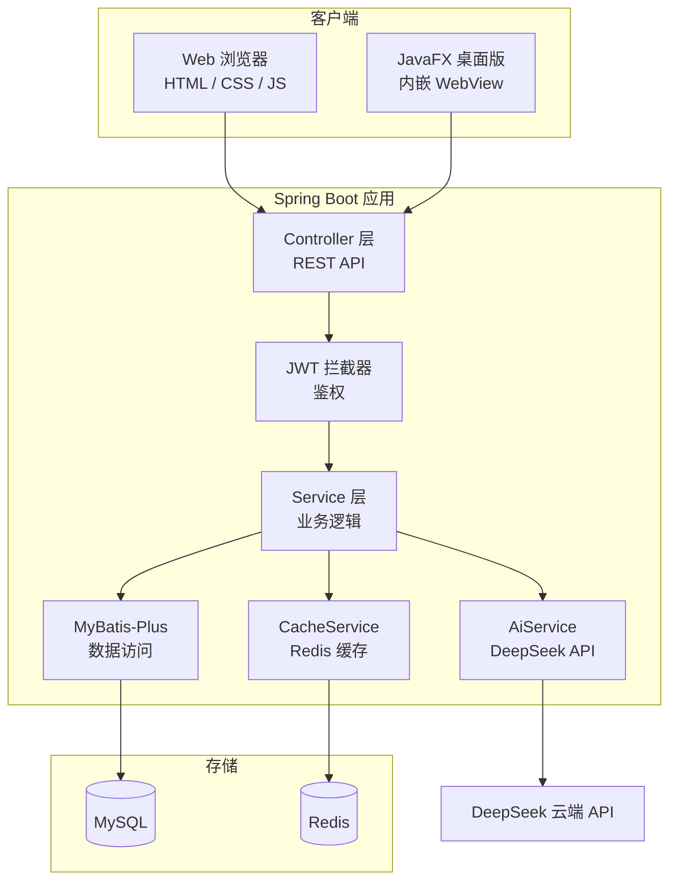

# AI Blog

基于 Spring Boot 的全栈 AI 博客系统，支持 **Web 网页** 与 **JavaFX 桌面独立窗口** 两种使用方式。

[](https://github.com/ttot626/ai-blog)
[](https://github.com/ttot626/ai-blog/releases)
[](https://github.com/ttot626/ai-blog/actions)

**在线演示：** http://47.97.85.200:8080

## 界面预览

| 首页（文章列表 + 分页） | 登录 / 注册 | 热门文章 |
|---|---|---|
|  |  |  |

## 系统架构



### 请求链路（以登录发文章为例）

1. 前端 `POST /user/login` → 后端校验 BCrypt 密码 → 返回 JWT
2. 前端携带 `Authorization: Bearer <token>` 调用 `POST /article/add`
3. `JwtInterceptor` 解析 Token，写入 `UserContext`
4. `ArticleService` 写入 MySQL，并清除 Redis 中的列表/热门缓存
5. 首页 `GET /article/list?page=1&size=10` → MyBatis-Plus 分页查询 → 可选 Redis 按页缓存

### 技术亮点（面试可讲）

- **JWT 无状态鉴权** + 可选登录（列表接口未登录也能看，点赞需登录）
- **BCrypt 密码加密**，旧明文密码首次登录自动升级
- **Redis 缓存**文章分页、热门榜、用户主页，写操作后主动失效
- **MyBatis-Plus 分页**（`PageResult` 统一返回 total/page/pages）
- **DeepSeek AI** 辅助摘要、标题、关键词、标签
- **Docker Compose** 一键部署 MySQL + Redis + App
- **31 个自动化测试** + GitHub Actions CI

## 下载桌面版（无需安装 Java）

前往 **[Releases 发布页](https://github.com/ttot626/ai-blog/releases)**，下载 `AIBlog-x.x.x-Windows.zip`：

1. 解压 zip
2. MySQL 执行 `sql\init.sql`
3. 修改 `config\application.yml` 数据库密码
4. （可选）设置环境变量 `DEEPSEEK_API_KEY` 启用 AI 功能
5. 双击 **`AI Blog.bat`** 启动

## 功能概览

| 模块 | 能力 |
|------|------|
| 用户 | 注册、登录（JWT）、个人主页 |
| 文章 | 发布、编辑、删除、**分页列表**、详情、热门排行 |
| 互动 | 评论与回复、点赞、收藏 |
| 缓存 | Redis 缓存文章列表、热门文章、用户信息 |
| AI | DeepSeek 摘要、标题优化、关键词与标签生成 |
| 文档 | Swagger / OpenAPI 接口文档 |
| 前端 | 响应式 Web UI，支持移动端 |

## 技术栈

Java 21 · Spring Boot 3.4 · MySQL · MyBatis-Plus · Redis · JWT · JavaFX · DeepSeek · Swagger · Docker

## 快速开始（本地开发）

### 1. 初始化数据库

在 MySQL 中执行 [`sql/init.sql`](sql/init.sql)，将创建 `ai_blog` 库及全部数据表。

### 2. 修改配置

编辑 [`src/main/resources/application.yml`](src/main/resources/application.yml) 中的数据库密码。

**DeepSeek AI** 通过环境变量配置（推荐，密钥不会写入代码）：

```bash
# Windows PowerShell
$env:DEEPSEEK_API_KEY="sk-你的密钥"

# Linux / macOS
export DEEPSEEK_API_KEY=sk-你的密钥
```

Redis 未启动时项目仍可运行，缓存会自动降级为直接查库。

### 3. 开发运行

```bash
mvn spring-boot:run
```

**运行测试：**

```bash
mvn test
```

测试使用 H2 内存数据库 + Mock Redis，无需本地 MySQL/Redis 即可执行。推送代码后 GitHub Actions 会自动跑测试。

| 模式 | 入口类 | 说明 |
|------|--------|------|
| 网页版 | `Xiangmu1Application` | 浏览器访问 http://localhost:8080 |
| 桌面版 | `DesktopLauncher` | JavaFX 独立窗口，内嵌 WebView |

接口文档：http://localhost:8080/swagger-ui.html

### 4. 本地打包 / 发布到 GitHub

**本地打包：** 双击 [`打包EXE.bat`](打包EXE.bat)，产物在 `target\dist\AIBlog-1.0.0-Windows.zip`

**发布到 GitHub（自动构建并上传）：**

```bash
git tag v1.0.1
git push origin v1.0.1
```

推送 tag 后，GitHub Actions 会自动打包并创建 [Release](https://github.com/ttot626/ai-blog/releases) 供他人下载。

> 请使用 `AI Blog.bat` 或 `AI Blog.vbs` 启动，勿用 `AIBlog.exe`。若内置 Java 缺失，运行 `修复启动.bat`。

## 云端部署（所有人共用同一个博客网站）

GitHub 下载的 zip 是**每人本地各用各的**；若要让**所有人通过网址在线发博客、看博客**，需要把 Web 版部署到云服务器。

详细步骤见 **[deploy/云端部署指南.md](deploy/云端部署指南.md)**，核心命令：

```bash
git clone https://github.com/ttot626/ai-blog.git
cd ai-blog
cp .env.example .env    # 修改 DB_PASSWORD、JWT_SECRET、DEEPSEEK_API_KEY
docker compose up -d --build
```

部署成功后访问 `http://你的服务器IP:8080`，全员共用同一套数据。

| 对比 | 桌面版 zip | 云端 Web 版 |
|------|-----------|-------------|
| 访问 | 仅本机 | 公网 URL，人人可访问 |
| 数据 | 各自独立 | 共享，文章全员可见 |
| 适合 | 本地演示 / 作业 | 公开博客、多人社区 |

## 环境变量说明

| 变量 | 必填 | 说明 |
|------|------|------|
| `DB_PASSWORD` | 生产必填 | MySQL root 密码 |
| `JWT_SECRET` | 生产必填 | JWT 签名密钥，至少 32 位 |
| `DEEPSEEK_API_KEY` | 可选 | DeepSeek API 密钥，启用 AI 功能 |
| `APP_PORT` | 可选 | 对外端口，默认 8080 |

> `.env` 文件已被 `.gitignore` 忽略，**切勿将真实密钥提交到 Git**。

## 核心接口

| 接口 | 方法 | 鉴权 |
|------|------|------|
| `/user/register` | POST | 否 |
| `/user/login` | POST | 否 |
| `/article/list?page=1&size=10` | GET | 否（可选登录，返回点赞/收藏状态） |
| `/article/hot` | GET | 否 |
| `/article/add` | POST | 是 |
| `/article/like` | POST | 是 |
| `/favorite/add` | POST | 是 |
| `/ai/summary` | POST | 是 |

鉴权请求头：`Authorization: Bearer <token>`

统一响应格式：

```json
{
  "code": 200,
  "message": "操作成功",
  "data": {}
}
```

文章列表分页响应示例：

```json
{
  "code": 200,
  "message": "查询成功",
  "data": {
    "records": [{ "id": 1, "title": "标题", "content": "正文" }],
    "total": 100,
    "page": 1,
    "size": 10,
    "pages": 10
  }
}
```

## 项目结构

```text
├── src/main/java/          # 后端业务代码
├── src/test/java/          # 单元测试 + 集成测试（31 个）
├── src/main/resources/
│   ├── static/             # Web 前端（HTML / CSS / JS）
│   ├── application.yml     # 本地开发配置
│   └── application-prod.yml  # Docker 生产配置
├── docs/screenshots/       # README 界面截图
├── sql/init.sql            # 数据库初始化脚本
├── deploy/                 # 云端部署指南与备份脚本
├── docker-compose.yml      # Docker 一键部署
├── .env.example            # 环境变量模板（复制为 .env 使用）
├── installer/              # 桌面版配置与修复脚本
└── 打包EXE.bat              # 一键打包桌面版
```

## 注意事项

- 用户密码使用 **BCrypt** 加密存储，数据库中不保存明文
- 旧账号首次登录会自动升级为 BCrypt 密文
- 核心逻辑含 **31 个**自动化测试（`src/test/java`）+ GitHub Actions CI，面试可重点讲解
- 定期备份：在服务器执行 `deploy/backup.sh` 可导出 MySQL 数据
- DeepSeek 需账户有余额才能调用，余额不足会返回 402 错误
- 请勿将 `.env`、真实 API Key 和数据库密码提交到公开仓库
- 打包产物（zip）体积约 300MB，已通过 GitHub Releases 分发，不提交进仓库

## 仓库

https://github.com/ttot626/ai-blog
